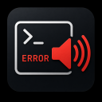

  

# Error Sound for Terminal

A simple [Visual Studio Code](https://code.visualstudio.com/) extension that plays a sound when a terminal command fails or prints an error message.

## Features

- Plays a sound when a terminal command exits with an error.
- Detects common terminal error patterns.
- Includes multiple built-in sounds.
- Supports imported custom `.wav` sound files.
- Provides a status bar toggle to enable or disable the extension.
- Supports different trigger modes.

## Commands

Open the Command Palette with `Ctrl + Shift + P` and search for one of the following commands:

| Command | Description |
|---|---|
| `Terminal Error Sound: Test Sound` | Plays the currently selected sound. |
| `Terminal Error Sound: Choose Built-in Sound` | Selects one of the built-in sounds. |
| `Terminal Error Sound: Import Custom Sound` | Imports a custom `.wav` sound file. |
| `Terminal Error Sound: Reset Custom Sound` | Resets the sound to the default built-in sound. |
| `Terminal Error Sound: Toggle Enabled` | Enables or disables the extension. |
| `Terminal Error Sound: Choose Trigger Mode` | Changes when the sound should be played. |

## Trigger Modes

| Mode | Description |  
|---|---|
| `Patterns` | Plays a sound when an error pattern is detected in the terminal output. |
| `Exit Code` | Plays a sound when a command exits with a non-zero exit code. |
| `Both` | Uses both detection methods. |

## Requirements

Terminal error detection works best when VS Code Terminal Shell Integration is enabled.

## Extension Settings

This extension contributes the following settings:

- `terminalErrorSound.enabled`
- `terminalErrorSound.soundPath`
- `terminalErrorSound.builtInSound`
- `terminalErrorSound.patterns`
- `terminalErrorSound.triggerMode`

## Sound Credits

Some built-in notification sounds were sourced from [Zedge](https://www.zedge.net/notification-sounds).  
All sound rights remain with their respective creators.

## License

MIT

## Contact

Created by [Nillan Sivarasa](https://github.com/nlln19).

For questions, feedback or issues, please open an issue on GitHub.
